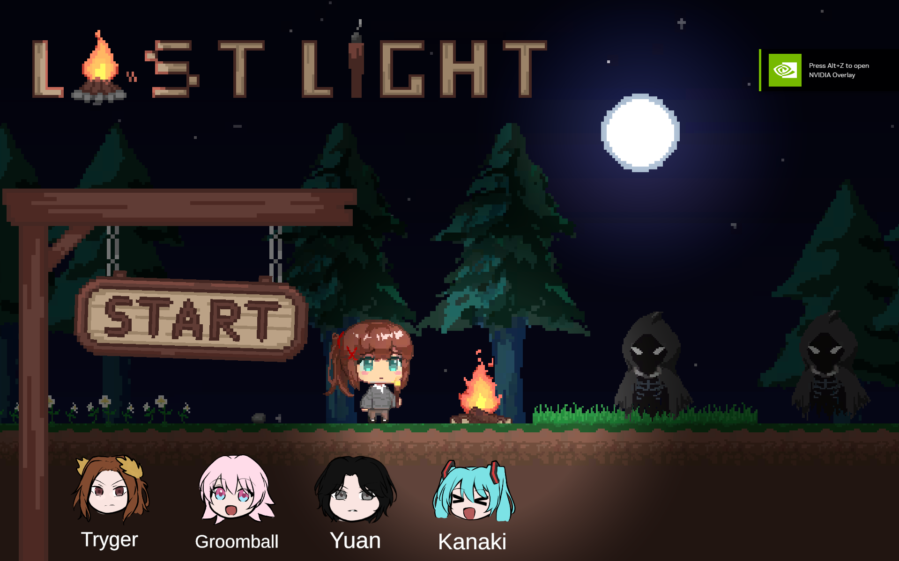

# 🔦 Last Light

### *Survive the night. Reach the dawn.*

A **2D Survival Horror** side-scrolling game built with Unity. You are alone in the pitch-black wilderness, armed only with a flickering torch and a dying campfire. Monsters lurk in the dark — and they only get hungrier as the night wears on. Can you survive until the moon sets?

---

## 📸 Screenshots

| Main Menu | Gameplay | Gameplay |
|:---------:|:--------:|:--------:|
|  |  |  |

---

## 🎮 Gameplay Features

- **Side-scrolling survival** — Explore a dark 2D world with fluid movement and immersive footstep audio.
- **Torch system** — Your torch lasts **60 seconds** and doubles as both a light source and a weapon. Refuel it at the campfire to keep the darkness at bay.
- **Campfire mechanics** — A central campfire burns for **120 seconds** and can be extended by depositing wood. It heals the player and refills the torch.
- **Wood inventory & weight system** — Collect three tiers of wood (10s / 25s / 45s time value) with a maximum of **10 items** in your backpack. Manage your inventory wisely.
- **Dynamic enemy AI** — Enemies patrol and chase. As the night progresses, they spawn faster and in greater numbers across **3 difficulty phases**.
- **Health & Sanity** — Taking damage drains your health and sanity. The game punishes recklessness.
- **5-minute moon timer** — Survive until the moon disappears over the horizon to win.
- **Dynamic 2D lighting** — Powered by Unity URP's `Light2D` system for a tense, atmospheric experience.

---

## 🕹️ How to Play

- **Move** — `A / D` or `Left / Right Arrow` keys
- **Jump** — `Spacebar`
- **Deposit wood** — Stand near the campfire to deposit collected wood and extend its burn time
- **Refill torch** — Approach the campfire with your torch equipped
- **Avoid enemies** — Getting hit reduces your health. The torch can **stun** or damage enemies briefly

**Goal:** Survive from nightfall until moonrise. If your health reaches zero, it's game over — but you can restart or return to the main menu.

---

## 🛠️ Tech Stack

| Technology | Purpose |
|-----------|---------|
| **Unity 2D (URP)** | Game engine & rendering pipeline |
| **C#** | Core gameplay scripts |
| **Unity Light2D** | Dynamic 2D lighting system |
| **Sprite-based animation** | Player & enemy visuals |

---

## 📦 Installation

1. **Clone the repository**
   ```bash
   git clone https://github.com/your-username/last-light.git
   ```

2. **Open in Unity**
   - Launch Unity Hub
   - Click **Open** and select the project folder
   - Ensure you are using a **URP-compatible Unity version** (2022.3 LTS or later recommended)

3. **Build & Run**
   - Go to `File → Build Settings`
   - Select your target platform (Windows, macOS, Linux)
   - Click **Build** and choose an output folder
   - Run the executable

> **Note:** The game is configured with Unity's **Universal Render Pipeline (URP)** for its 2D lighting features. Make sure the URP package is installed.

---

## 👥 Credits

**Last Light** was brought to life by a dedicated team:

| Role | Name |
|------|------|
| **Programmer** | [Tryger](https://github.com/TrygerZ) |
| **Programmer** | [Groomball](https://github.com/Groomball) |
| **Game Designer** | [RooneyTP](https://github.com/RooneyTP) |
| **2D Artist** | [sambryann19](https://github.com/sambryann19) |

---
